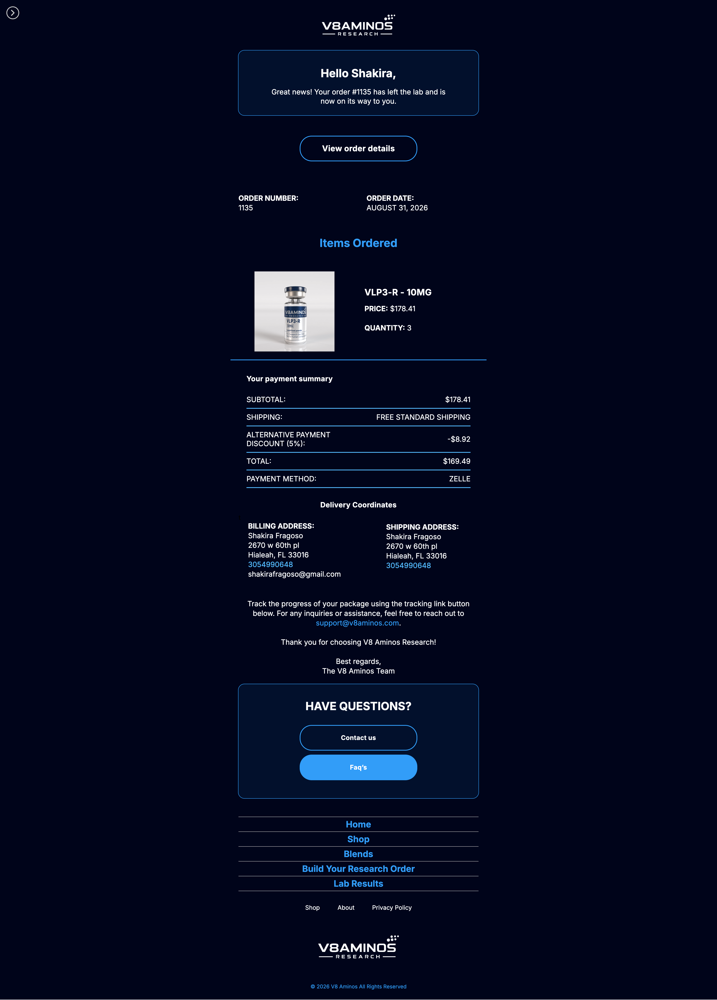

# Custom Email Templates

Customised and overridden email templates for the application, providing improved email layouts and branding for customer-facing communications.

## ✨ Overview

This repository contains customised email templates that override the default email templates provided by the application.

The templates have been modified to provide:

- Improved email layout and presentation
- Custom branding
- Better readability
- Responsive email styling
- Consistent design across different email notifications

## 📧 Email Templates

### Order Confirmation

The customised order confirmation email provides customers with a clear summary of their order and relevant information.



### Order Shipped

Customised shipping notification email.


### Other Templates

Additional email templates can be added to the `screenshots/` directory and documented here.

## 📁 Project Structure

```text
.
├── README.md
├── screenshots/
│   ├── completed_order.png
│   ├── cancelled_order.png
│   └── ...
└── templates/
    └── ...